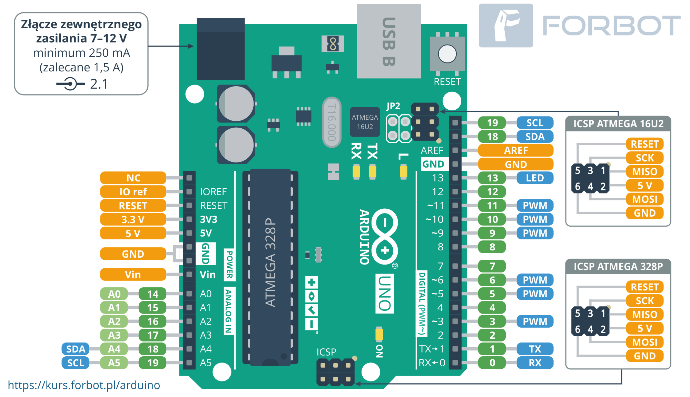

# Wykrywacz dymu
________________________

# O PROJEKCIE

Projekt dotyczy działania czujnika MQ-9. Naszym zadaniem jest odczytanie z powietrza zawartości stężenia gazów. Jeśli na wyjściu czujnika odczytamy wartość, która przekracza wartość progową powinna się zaświecić dioda czerwona LED i buzzer powinien wydać dźwięk. Natomiast jeśli stężenie nie przekracza wartości progowej powinna się cały czas świecić dioda zielona LED.

# Czym jest czujnik MQ-9?

Jest to czujnik, który umożliwia nam wykrycie w powietrzu stężenia tlenku węgla, bądź gazów łatwopalnych.

# Potrzebne komponenty:

- arduino UNO;
-płytka stykowa;
- MQ-9 czujnik dymu(gazów);
- 5mm LED: Czerwona;
- 5mm LED: Zielona;
- Buzzer;
-kable;
- rezystory 221 Ohm.


# Sposób działania projektu:

Napięcie, które jest wysyłane przez czujnik jest proporcjonalne do stężenia gazów -  odpowiednio się zmienia. 
Innymi słowy im większe stężenie gazów, bądź tlenku węgla, tym większe będzie napięcie wyjściowe, a jeśli będzie niższe stężenie gazów, bądź tlenku węgla, tym niższe będzie napięcie wyjściowe.

# (https://create.arduino.cc/projecthub)

 
 
# Etap 1

```cpp
int czerwonaDioda = 12;
int zielonaDioda = 11;     //definicja portów 
int buzzer = 10;
int czujnikDymu = A5;
int wartoscProgowa = 400; //wartość progowa - jeśli stężenie gazów w powietrzy przekroczy ten próg to dioda zaświeci się na kolor czerwony i buzzer wyda dźwięk(można ją zmieniać)
void setup() {
  pinMode(czerwonaDioda, OUTPUT);
  pinMode(zielonaDioda, OUTPUT);
  pinMode(buzzer, OUTPUT);            //definicja wejść i wyjść
  pinMode(czujnikDymu, INPUT);
  Serial.begin(9600);
}

void loop() {
  int sensor = analogRead(czujnikDymu); //czujnik zczytuje zawartość gazów w powietrzu  

  Serial.print("Pin A0: ");
  Serial.println(sensor); //wyświetlenie na monitorze  portu szeregowego dla dodatkowego zobrazowania
  //stawiamy warunek, jeśli wartość gazów w powietrzu jest niższa niż nasza wartość podana na początku(wartoscProgow) 
  //to zaświeci się dioda zielona i buzzer nie wyda dźwięku,
  //natomiast jeśli przekroczy zaświeci się didoa czerwona i buzzer wyda dźwięk
  if (sensor > wartoscProgowa)
  {
    digitalWrite(czerwonaDioda, HIGH); //czerowna zapali się
    digitalWrite(zielonaDioda, LOW);   //zielona gaśnie
    tone(buzzer, 1000, 200);   //buzzer wyda dźwięk
  }
  else
  {
    digitalWrite(czerwonaDioda, LOW); //czerwona gaśnie
    digitalWrite(zielonaDioda, HIGH); //zielona zapali się
    noTone(buzzer);
  }
  delay(100);
}```
